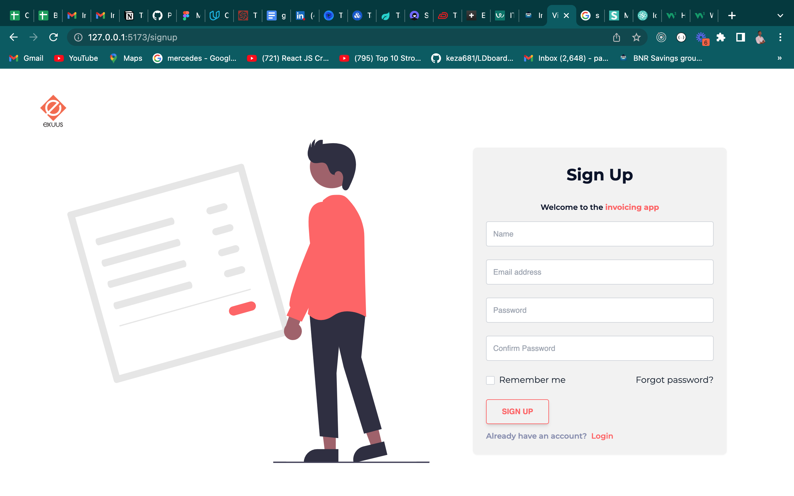

# INVOICING APP

Cloning exercice

## OVERVIEW

[Live version](https://exuus-invoicing-app.netlify.app/home)

- Dashboard
  

- Login
  

- Signup
  

## Run the project

`Yarn start`

## Built With

- ReactJs
- Vite
- Tailwindcss
- Semantic UI

## preequests

- Vscode installed in your machine

## Getting Started

To get a local copy up and running follow these simple example steps.

- HTTPS:
  - `https://github.com/Paskab012/invoicing-app.git`

## Run tests

- No test provided

## Author

👤 **Pascal Kabika Mp**

- GitHub: [Paskab012](https://github.com/KABIKA681?tab=overview&from=2021-12-01&to=2021-12-31)
- LinkedIn: [LinkedIn](https://www.linkedin.com/in/pascal-kabika-443061220/)

## 🤝 Contributing

Contributions, issues, and feature requests are welcome!

Feel free to check the [issues page](https://github.com/Paskab012/lasles-clone/issues).

## Show your support

Give a ⭐️ if you like this project!

## Acknowledgments

- Exuus Rwanda: [exuus](https://exuus.com/)

## 📝 License

This project is [MIT](./MIT.md) licensed.
